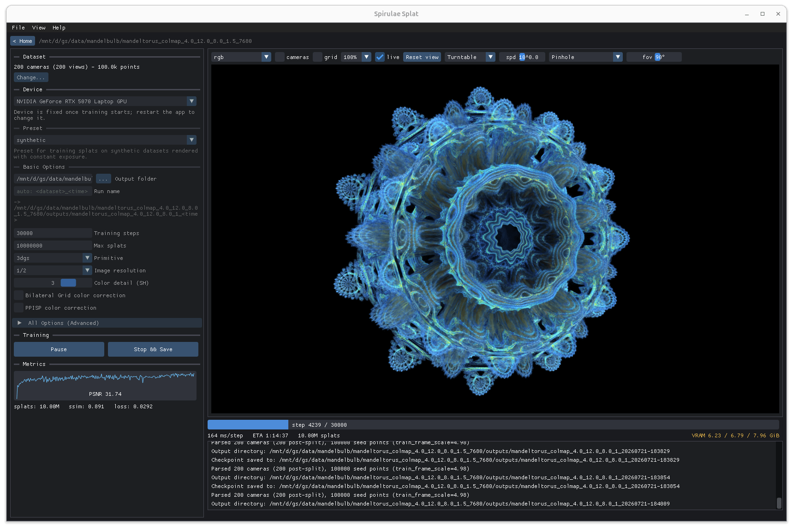

# Spirula Studio

[**Installation**](#installation) &#8226;
[**Quick Start**](#quick-start) &#8226;
[**Acknowledgement**](#acknowledgement) &#10073;
[**SuperSplat**](https://superspl.at/user?id=harry7557558) &#10073;
[**Online Viewer**](https://harry7557558.github.io/spirulae-splat/viewer/)

This is my personal project that trains 3D Gaussian Splatting (3DGS) models. Formerly Spirulae-Splat.



<div align="center">

*Screenshot of Spirula Studio GUI, showing it training 10 million SH3 Gaussians on 4k images, on a laptop GPU with 8GB VRAM.*

</div>

## Features
- Cross vendor support via Vulkan compute &ndash; Runs on **NVIDIA, AMD, Intel(R), and Apple** GPUs
- Unified densification strategy combining elements from **MCMC** and **IGS/IGS+/MRNF**
- Extreme **VRAM efficiency** with quantized training &ndash; Up to 10 million SH3 Gaussians in 8GB VRAM
- **Bilateral grid** and **PPISP** for exposure/WB correction
- Camera models: perspective, **equidistant/equisolid fisheye** (supports >180° fov like in typical **360 cameras**), **equirectangular/spherical**; fully supports radial, tangential, and thin prism distortion coefficients
- Generalization from small objects to **city-scale scenes** with minimum tuning
- **Depth and normal** supervision using monocular geometry models
- Training on images in linear and various wide-gamut color spaces (e.g. **ACEScg**)
- **Mesh generation**: Convert trained splats to vertex-color and/or textured mesh in multiple formats
- **Masking** (segment and ignore modes)
- 3DGS, **anti-aliased** 3DGS, and **3DGUT** primitives, with improved cross-viewer compatibility
- **Skybox**, with regularization to balance sky removal and discouraging transparency
- 2DGS-like depth regularization to discourage floaters
- And more (see "Quick start" below).

<!-- ### Scripts (see `scripts`)
- Extract frames from video, auto skip blurry frames
- Auto generate depth and normal maps
- Segmentation, with scripts for point (with GUI) and natural language prompts
- Downscale/Undistort datasets
- And more, etc. -->

# Installation

Spirula Studio provides two installation options:

- **Native CLI/GUI trainer with Vulkan backend:** The new cross-platform and cross-vendor option. Works on all major GPUs.

- **Native CLI/GUI trainer with CUDA backend:** Recommended option for CUDA-capable NVIDIA GPUs.

Both provide the same training functionality; each adds a few tools of its own.

| Installation Option | GPU/Vendor Support | Platform Support | Dependencies | Additional Features |
|--------|--------|--------|--------|--------|
| Native Vulkan CLI/GUI | NVIDIA, AMD, Intel(R), Apple Silicon | Windows, Linux, macOS | Vulkan/MoltenVK, CMake/Ninja | Native support for SfM, frame extraction from videos, and AI masking |
| Native CUDA CLI/GUI | CUDA-capable NVIDIA GPUs | Windows, Linux | CUDA, CMake/Ninja | Meshing |

## Native CLI/GUI trainer with Vulkan backend

Make sure you have Vulkan SDK (or MoltenVK for macOS) installed. Clone the repository and run the commands:

### Windows with MSVC:

```bat
cd spirulae-splat\
build_develop.bat -DSS_BUILD_CLI=ON -DSS_BUILD_GUI=ON -DSS_BACKEND=vulkan -DSS_ENABLE_PATENTED=ON
```

If it builds successfully, you get `build\spirula.exe`. Run it with no arguments for the GUI, or `spirula train --help` / `spirula sfm --help` / `spirula sam --help` for the command-line tools.

### Windows with GCC/Clang:

```bat
cd spirulae-splat\
cmake -G Ninja -B build -DCMAKE_BUILD_TYPE=Release -DSS_BUILD_CLI=ON -DSS_BUILD_GUI=ON -DSS_BACKEND=vulkan -DSS_ENABLE_PATENTED=ON -DCMAKE_MAKE_PROGRAM=Ninja
cmake --build build -j
```

Pass `-DCMAKE_C_COMPILER` and `-DCMAKE_CXX_COMPILER` to the first `cmake` command if needed.

If it builds successfully, you get `build\spirula.exe`. Run it with no arguments for the GUI, or `spirula train --help` / `spirula sfm --help` / `spirula sam --help` for the command-line tools.

### Linux / macOS:

```bash
cd spirulae-splat/
bash build_develop.bash -DSS_BUILD_CLI=ON -DSS_BUILD_GUI=ON -DSS_BACKEND=vulkan -DSS_ENABLE_PATENTED=ON
```

If it builds successfully, you get `build/spirula` binary. Run it with no arguments for the GUI, or as `spirula sfm`, `spirula train` and `spirula sam` for the command-line tools (`--help` on any of them).

### Notes regarding third-party licensing

`-DSS_ENABLE_PATENTED=ON` enables decoding video on the GPU instead of shelling out to ffmpeg (about 15x faster frame extraction, and without need to install ffmpeg). However, AVC/HEVC bitstream parsers carry third-party patent exposure. If you turn this on, you are responsible for ensuring compliance with local patent laws regarding AVC/HEVC playback.

Masking needs a SAM checkpoint, which the GUI downloads on first use and caches. The checkpoints are Meta's models under Meta's licenses &ndash; SAM 2.1 is Apache-2.0, SAM 3 is under Meta's own, non-standard license. They are never bundled, and the GUI shows the terms before fetching anything. On the command line, point `--model` at a file you downloaded yourself.

## Native CLI/GUI trainer with CUDA backend

Make sure you have a recent version of CUDA installed. On Windows, you also need MSVC compiler compatible with your CUDA version. Clone the repository and run the commands:

### Windows:

```bat
cd spirulae-splat\
build_develop.bat -DSS_BUILD_CLI=ON -DSS_BUILD_GUI=ON -DSS_BACKEND=cuda
```

If it builds successfully, you get `build\spirula.exe`. Run it with no arguments for the GUI, or `spirula train --help` / `spirula mesh --help` for the command-line tools.

### Linux:

```bash
cd spirulae-splat/
bash build_develop.bash -DSS_BUILD_CLI=ON -DSS_BUILD_GUI=ON -DSS_BACKEND=cuda
```

If it builds successfully, you get `build/spirula` binary. Run it with no arguments for the GUI, or as `spirula train` and `spirula mesh` for the command-line tools.

# Quick start

For the GUI, open the program and follow the instructions. For the CLI, run `path/to/build/spirula train --help`, or `spirula train <preset name> --help`, for detailed usage.

### Presets
Spirula Studio provides presets. Run `spirula train <preset name> --data [DATASET_PATH] <additional args>` to use a preset. List of presets:
- `3dgs`: Generic method that works well for most datasets.
- `360-camera`: Preset for training on original distorted images captured by 360 cameras. Recommended if your dataset contains fisheye images with a circle visible.
- `in-the-wild`: Preset for in-the-wild datasets, like datasets consisting of internet images, or datasets with extreme lighting variation and/or un-masked outliers.
- `linear-color`: Preset for training splats in linear color spaces (e.g. ACEScg).
- `meshing`: Preset for meshing. After training, use `spirula mesh` to extract mesh.
- `synthetic`: Preset for training splats on synthetic datasets rendered with constant exposure.
- `academic-baseline`: Preset that replicates 3DGS MCMC as faithful as possible.

### Datasets
- Spirula Studio supports COLMAP and Nerfstudio datasets, as well as masks, depth and normal maps, etc. Dataset format can be specified with `--data_format`. If not specified, it will automatically detect.
- A COLMAP dataset contains files named `cameras`, `images`, and `points3D` with extension `.bin` or `.txt`, typically in a sub-folder named `sparse/0` (can be specified with `--colmap_recon_dir`).
- For COLMAP dataset, it's assumed that there's a sub-folder containing images, and optionally subfolders containing masks, depth maps, and normal maps. Sub-folder names can be specified with `--image_dir`, `--mask_dir`, `--depth_dir`, and `--normal_dir` (default values are `images`, `masks`, `depths`, and `normals`).
- Masks and depth/normal maps will be automatically loaded if exists. To disable so, use `--no_load_depths` and `--no_load_normals`.
- An extended Nerfstudio dataset can be used for camera models not compatible with COLMAP format (e.g. camera models used by Agisoft Metashape and Reality Scan). The dataset typically contains a file named `transforms.json` as well as a sparse PLY point cloud containing 3D points and 8-bit colors, and can be generated by `scripts/process_data_(colmap|metashape).py`.
- There's experimental support for parsing proprietary Agisoft Metashape dataset. To do so, export cameras as XML, and point clouds as PLY with 8-bit RGB colors, and store them in the same folder as dataset folder. Optionally, save Metashape `.psx` file in the same folder, which is required for resolving file name ambiguity.

### Viewer
- A native viewer is included in the GUI.
- For CLI, similar to Nerfstudio and GSplat, you can open the link `http://localhost:7007/` in a web browser to view training progress. The port may be forwarded if you are training headless on cloud GPUs.
- To change the port from 7007 to some other value, use `--viewer_port <port number>`.
- By default, viewer continues running after training. To make it exit when training finishes, use `--no_keep_viewer_alive`. Viewer can be disabled with `--disable_viewer`.

### Gaussian representation
- Change number of Gaussians: `--cap_max 6000000` (default 1000000)
- Change SH degree: `--sh_degree 1` (default 3)
- Set primitive using `--primitive` (default `3dgs`, change to `mip` or `3dgut` for potentially better visual quality but worse compatibility with existing viewers)

### Exposure/WB correction
- Both bilateral grid and PPISP are enabled by default, disable using `--no_use_bilateral_grid` and `--no_use_ppisp`.
- Change shape from default `(16, 16, 8)` to `(8, 8, 4)` using `--bilagrid_shape 8 8 4` (sometimes gives less color shift)
- Bilateral grid types: `--bilagrid_type (affine|ppisp|loglinear)`. Affine is original bilateral grid, PPISP (default) gives less color shift, loglinear is similar to PPISP but is more stable to train.
- PPISP types: `--ppisp_param_type (original|rqs|no_crf)`. Default is `no_crf` that gives more accurate colors.
- Note: Unlike most training software, Spirula Studio uses AdaGrad instead of Adam optimizer for bilateral grid and PPISP (disable using `--no_use_adagrad_bilagrid_optim` and `--no_use_adagrad_ppisp_optim`). Order of application can be configured with `--apply_ppisp_before_bilagrid` and `--no_apply_ppisp_before_bilagrid`.

### Distorted/Fisheye/Spherical images
- Spirula Studio supports directly training on distorted images. Pointing `spirula train` to an distorted dataset will simply work. Spirula Studio also supports datasets with mixed pinhole, fisheye, and equirectangular images.
- `3dgs` preset works well for general pinhole, fisheye, and equirectangular datasets. If your dataset contains very wide fisheye images (especially those with a circle visible), we recommend `360-camera` preset, which will internally undistort a fisheye image to 5 pinhole faces.
- By default, Spirula Studio uses `3dgs` primitive. which handles camera distortion in a style similar to Fisheye-GS. Set `--primitive` to `mip` for anti-aliased 3DGS, or `3dgut` for 3DGUT. Note that 3DGUT is slower to train and may have worse compatibility with existing viewers.
- `--max_screen_size 0.3` is enabled by default for compatibility conventional viewers. Increase it for potentially better quality in built-in viewer, decrease it for better compatibility with other viewers (e.g. SuperSplat viewer, especially if you notice spikes or large floaters)
- Supported camera models: perspective, equidistant and equisolid fisheye (supports >180° fov); Supported distortion parameters: k1-k4, p1, p2, sx1, sy1, b1, b2.

### In-the-wild images
- Spirula Studio has an `in-the-wild` preset that's designed to handle images with strong lighting variation and/or large unmasked distractors, like those from web-scraped images of landmarks
- By default, this presets uses 0.9 L1 + 0.1 SSIM loss (instead of 0.8/0.2), `--densify_score_mode median` (instead of `mean` in `3dgs` preset), and `--densify_loss_map_mode robust_edge_aware` (instead of `ssim_structure` in `3dgs` preset).
- Set `--densify_robust_edge_aware_quantile` (default 0.75) to a lower number for large distractors, and higher number for low distractor datasets for potentially higher quality.

### Background control
- By default, Spirula Studio trains a black background, consistent with most 3DGS training software.
- To discourage transparency, use `--background_mode noise`.
- To train a skybox, use `--background_mode sh`.
- If mask is provided, use `--apply_loss_for_mask` to mask e.g. sky, background, and False to mask e.g. people and cars.

### Training large-scale scenes
- Spirula Studio works out of box for scenes with various scale and complexity with extreme VRAM efficiency. Unlike some training software, there is no need to tune position learning rate, opacity regularization, etc. in Spirula Studio.
- For high-resolution images, setting `--num_loss_scales` (default 0) may help convergence. We recommend 1 for 1080p images, 2 for 4k images, and 3 for 8k images.

### Linear and wide-gamut color spaces
- Use `linear-color` preset for training splats in linear color spaces. This assumes gamma-corrected Rec.2020 input images, and trains splats in linear ACEScg color space.
- To specify linear color space for splat and input images, use `--image_color_is_linear` and `--splat_color_is_linear True`. 16 bit PNG is recommended for linear input images.
- To specify color gamut for splat and input images, use `--image_color_gamut` and `--splat_color_gamut`. (supports `ACES2065-1`, `ACEScg`, `Rec.2020`, `AdobeRGB`, `DCI-3`)
- Specify `--convert_initial_point_cloud_color True` if colors in initial point cloud is in sRGB, and color in initial point cloud will be converted to splat's color space. If you don't specify True or False, it will auto decide based on arguments.
<!-- 
- Batch many tiny tiles instead of whole images: `spirulae-train 3dgs-patched ...` instead of `spirulae-train 3dgs`
- Validation (early stop training if loss on validation images start to increase): append `nerfstudio-data --validation_fraction 0.1` to the end of training command
- Second-order optimizer using Jacobian-residual product and Hessian diagonal: `spirulae-train 3dgs^2-pos` (more stable) or `3dgs^2` (less stable) instead of `spirulae`. We also provide presets `3dgs^2-confined` and `3dgs^2-open` for the corresponding presets with `3dgs^2` methods, which otherwise run on `3dgs^2-pos`.
    - Note: on Windows, you may need to wrap parentheses around method name with `^2`. For example, use `spirulae-train "3dgs^2-pos"` instead of `spirulae-train 3dgs^2-pos`.
- 2DGS-like depth regularization to discourage floaters: `--depth_distortion_reg 0.01`. Similar regularization can also be applied to RGB by setting `--rgb_distortion_reg` to a positive value. -->

### Scripts
- Use `scripts/mask.py` to generate masks (Example usage: `python3 scripts/mask.py path/to/dataset --prompt "person; car; fisheye border" --negative-prompt "person in painting"`). By default, this runs on [lang-sam](https://github.com/luca-medeiros/lang-segment-anything) model. Use `--model sam3` to switch to [SAM 3](https://github.com/facebookresearch/sam3) model for often better results (may require applying for access and logging in to Huggingface).
- Use `scripts/predict_geometry.py` to generate depth and normal maps using [Metric3D v2](https://github.com/YvanYin/Metric3D) model, and optionally sky segmentation maps with various model options.
- Use `scripts/extract_frames.py` to extract frames from a video, while skipping blurry frames. Supports various video formats, including most `.mp4`, `.mov`, and `.insv` videos.
- `scripts/downscale_dataset.py`, `scripts/undistort_dataset.py`: self-explanatory
<!-- - Use `scripts/export_ply_3dgs.py` to export PLY
- To process data, use `scripts/process_data_colmap.py` and `scripts/process_data_metashape.py`, will bypass `ns-process-data` limitations (e.g. `THIN_PRISM_FISHEYE`) -->

# Acknowledgement

Spirula Studio begins as a fork of:
- Nerfstudio: https://github.com/nerfstudio-project/nerfstudio/
- GSplat: https://github.com/nerfstudio-project/gsplat

The SfM module in Spirula Studio is heavily inspired by [COLMAP](https://github.com/colmap/colmap/), and the masking module is heavily inspired by [sam3.cpp](https://github.com/PABannier/sam3.cpp).

Spirula Studio uses Slang shading language https://shader-slang.org/ to implement GPU kernels, which provides autodiff capability that effectively accelerates development, and reserves flexibility to support additional backends (e.g. Vulkan, WebGPU) in the future.

We also thank various members from [MrNeRF & Brush](https://discord.gg/NqwTqVYVmj) (and previously Nerfstudio) Discord communities for providing ideas and feedback.

In addition, Spirula Studio has been inspired by, or shares similarities with, ideas from the following works:

### Representation
Spirula Studio uses Fisheye-GS and 3DGUT to handle camera distortion, as well as supporting anti-aliased Mip-Splatting primitive. Spherical voronoi for direction-dependent color, as well as splatting opaque triangles, are supported in `dev-mid2026` branch, and there had been efforts toward implementing voxel primitives. Prior to mid 2025, Spirula Studio implements a modified 2DGS with polynomial kernels, but switched to 3DGS as it has become more standardized.
- *3D Gaussian Splatting for Real-Time Radiance Field Rendering*, by Kerbl et al. &ndash; https://arxiv.org/abs/2308.04079
- *Mip-Splatting: Alias-free 3D Gaussian Splatting*, by Yu et al. &ndash; https://arxiv.org/abs/2311.16493
- *3DGUT: Enabling Distorted Cameras and Secondary Rays in Gaussian Splatting*, by Wu et al. &ndash; https://arxiv.org/abs/2412.12507
- *Fisheye-GS: Lightweight and Extensible Gaussian Splatting Module for Fisheye Cameras*, by Liao et al. &ndash; https://arxiv.org/abs/2409.04751
- *Efficient Perspective-Correct 3D Gaussian Splatting Using Hybrid Transparency*, by Hahlbohm et al. &ndash; https://fhahlbohm.github.io/htgs/
- *Spherical Voronoi: Directional Appearance as a Differentiable Partition of the Sphere*, by Di Sario et al. &ndash; http://arxiv.org/abs/2512.14180
- *Triangle Splatting+: Differentiable Rendering with Opaque Triangles*, by Held et al. &ndash; https://arxiv.org/abs/2509.25122
- *Sparse Voxels Rasterization: Real-time High-fidelity Radiance Field Rendering*, by Sun et al. &ndash; https://arxiv.org/abs/2412.04459
- *2D Gaussian Splatting for Geometrically Accurate Radiance Fields*, by Huang et al. &ndash; https://arxiv.org/abs/2403.17888

### Densification
Spirula Studio started as a Nerfstudio and GSplat fork, which implements ADC, AbsGS, and MCMC densifications. Currently, Spirula Studio uses a unified densification strategy, combining elements from ADC, MCMC, and IGS/IGS+/MRNF.
- *3D Gaussian Splatting as Markov Chain Monte Carlo*, by Kheradmand et al. &ndash; https://arxiv.org/abs/2404.09591
- *Taming 3DGS: High-Quality Radiance Fields with Limited Resources*, by Mallick et al. &ndash; https://arxiv.org/abs/2406.15643
- *Improving Densification in 3D Gaussian Splatting for High-Fidelity Rendering*, by Deng et al. &ndash; https://arxiv.org/abs/2508.12313
- *ImprovedGS+: A High-Performance C++/CUDA Re-Implementation Strategy for 3D Gaussian Splatting*, by Jordi Muñoz Vicente &ndash; https://arxiv.org/abs/2603.08661
- LichtFeld Studio, by MrNeRF and other contributors &ndash; https://lichtfeld.io/
- *RobustNeRF: Ignoring Distractors with Robust Losses*, by Sabour et al. &ndash; https://arxiv.org/abs/2302.00833
- *AbsGS: Recovering Fine Details for 3D Gaussian Splatting*, by Ye et al. &ndash; https://arxiv.org/abs/2404.10484

### Exposure/WB correction
Spirula Studio mainly uses bilateral grid to handle changes in camera setting and environmental lighting, with option to predict affine matrices, PPISP parameters, linear matrices with log-encoded diagonals, and a few more.
- *Bilateral Guided Radiance Field Processing*, by Wang et al. &ndash; https://arxiv.org/abs/2406.00448
- *PPISP: Physically-Plausible Compensation and Control of Photometric Variations in Radiance Field Reconstruction*, by Deutsch et al. &ndash; https://arxiv.org/abs/2601.18336

### Optimization
To achieve high VRAM efficiency and acceptable training speed, Spirula Studio incorporates various optimizations, including kernel fusion throughout implementation, optimized rasterization backward implementation, improved Gaussian-tile association, etc. Previously, there were options to offload optimizer states to reduce VRAM usage at cost of slower training; current implementation addresses VRAM efficiency with quantization, with minimal impact on training speed and quality.
- *VkSplat: High-Performance 3DGS Training in Vulkan Compute*, by Chen et al. &ndash; https://arxiv.org/abs/2605.00219
- *Taming 3DGS: High-Quality Radiance Fields with Limited Resources*, by Mallick et al. &ndash; https://arxiv.org/abs/2406.15643
- *StopThePop: Sorted Gaussian Splatting for View-Consistent Real-time Rendering*, by Radl et al. &ndash; https://arxiv.org/abs/2402.00525
- *Faster-GS: Analyzing and Improving Gaussian Splatting Optimization*, by Hahlbohm et al. &ndash; https://arxiv.org/abs/2602.09999 (originally LichtFeld Studio bounty 001)
- *CLM: Removing the GPU Memory Barrier for 3D Gaussian Splatting*, by Zhao et al. &ndash; https://arxiv.org/abs/2511.04951

### Meshing
Spirula Studio is able to generate mesh from 3DGS models, by evaluating an opacity field and then apply marching tetrahedra on Delaunay triangulated meshes. Depth distortion and Gaussian anisotropy regularizations are used to ensure mesh fidelity.
- *Gaussian Opacity Fields: Efficient Adaptive Surface Reconstruction in Unbounded Scenes*, by Yu et al. &ndash; https://arxiv.org/abs/2404.10772
- *From Blobs to Spokes: High-Fidelity Surface Reconstruction via Oriented Gaussians*, by Gomez et al. &ndash; https://arxiv.org/abs/2604.07337
- *RaDe-GS: Rasterizing Depth in Gaussian Splatting*, by Zhang et al. &ndash; https://arxiv.org/abs/2406.01467
- *Effective Rank Analysis and Regularization for Enhanced 3D Gaussian Splatting*, by Hyung et al. &ndash; https://arxiv.org/abs/2406.11672
- *PhysGaussian: Physics-Integrated 3D Gaussians for Generative Dynamics*, by Xie et al. &ndash; https://arxiv.org/abs/2311.12198
- *Fast BVH Construction on GPUs*, by Lauterbach et al. &ndash; https://luebke.us/publications/eg09.pdf
- *Maximizing Parallelism in the Construction of BVHs, Octrees, and k-d Trees*, by Tero Karras. &ndash; https://developer.nvidia.com/blog/parallelforall/wp-content/uploads/2012/11/karras2012hpg_paper.pdf
- Geogram, by Bruno Levy and other contributors &ndash; https://github.com/BrunoLevy/geogram

### Additional features
Spirula Studio uses trust-region optimizer for training stability, and a second-order optimizer implementation is available in `dev-mid2026` branch. There's experimental support for batching many tiles instead of whole images to achieve NeRF-like convergence and camera optimization performance, in which BVH is used for fast tile-Gaussian association computation. Skybox is also supported.
- *3DGS^2-TR: Scalable Second-Order Trust-Region Method for 3D Gaussian Splatting*, by Hsiao et al. &ndash; https://arxiv.org/abs/2602.00395
- *Tile-wise vs. Image-wise: Random-Tile Loss and Training Paradigm for Gaussian Splatting*, by Zhang et al. &ndash; [openaccess.thecvf.com](https://openaccess.thecvf.com/content/ICCV2025/html/Zhang_Tile-wise_vs._Image-wise_Random-Tile_Loss_and_Training_Paradigm_for_Gaussian_ICCV_2025_paper.html)
- *Splatfacto-W: A Nerfstudio Implementation of Gaussian Splatting for Unconstrained Photo Collections*, by Xu et al. &ndash; https://arxiv.org/abs/2407.12306

### Foundation models
Spirula Studio uses the following foundation deep learning models, covering automatic mask generation, monocular depth and normal estimation, etc. Also, there has been effort toward a lightweight, CNN-based model to enhance blurry and compressed images.
- *Metric3Dv2: A Versatile Monocular Geometric Foundation Model for Zero-shot Metric Depth and Surface Normal Estimation*, by Hu et al. &ndash; https://arxiv.org/abs/2404.15506
- *SAM 3: Segment Anything with Concepts*, by Meta Research &ndash; https://github.com/facebookresearch/sam3
- Language Segment-Anything, by Luca Medeiros &ndash; https://github.com/luca-medeiros/lang-segment-anything
- SAM2-GUI, by Yunxuan Mao &ndash; https://github.com/YunxuanMao/SAM2-GUI
- *Depth Anything 3: Recovering the Visual Space from Any Views*, by Lin et al. &ndash; https://arxiv.org/abs/2511.10647
- *U^2-Net: Going Deeper with Nested U-Structure for Salient Object Detection*, by Qin et al. &ndash; https://arxiv.org/abs/2005.09007

## Trivia

Spirula Studio is named after the now-inactive project [spirulae](https://github.com/harry7557558/spirulae), which was named after the [deep-ocean cephalopod mollusk](https://en.wikipedia.org/wiki/Spirula).

